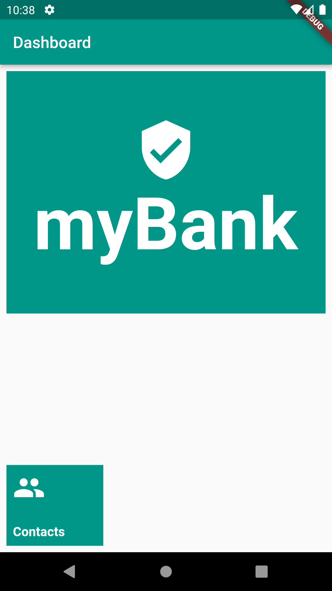
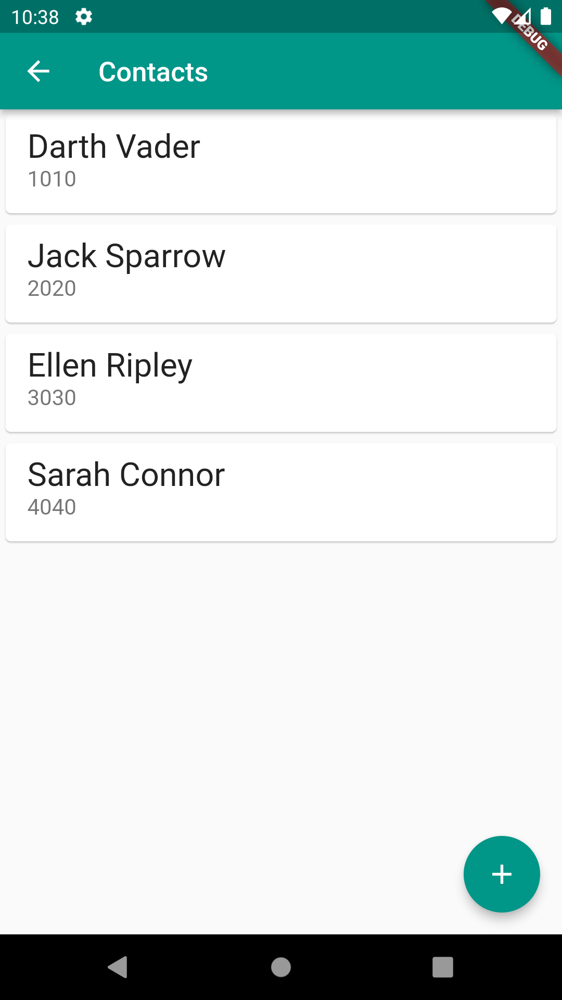
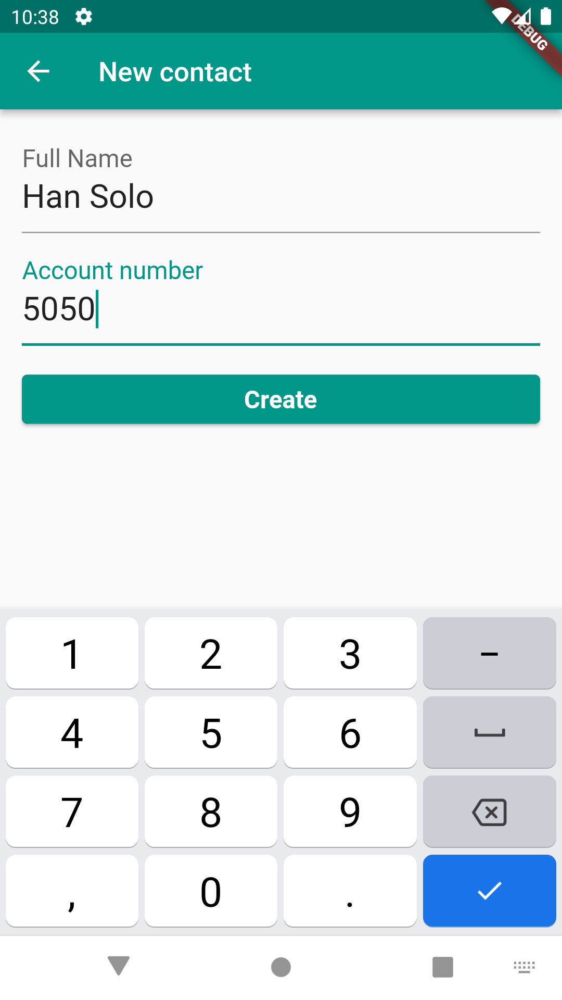

# Persistência com Flutter

## Objetivos ao completar os estudos
- Possibilidades comuns para armazenamento interno com o Flutter
- Aprenda a instalar e configurar o sqflite no Flutter
- Implemente comportamentos de busca e inserção no banco de dados
- Utilize o FutureBuilder para carregar dados de maneira assíncrona
- Entenda e refatore o código com async await
- Organize o código do banco de dados com o padrão DAO

## Ementas:

### Implementando o Dashboard
- Orientações iniciais e organização do curso
- Criando o projeto
- Adicionando imagem e botão de contatos
- Ajustando o visual do Dashboard
- Ajustando alinhamento e tema
- O que aprendi?
    - Adicionar imagens via rede ou assets;
    - Alinhamento dos filhos do Widget `Column`.

### Implementando todo o fluxo do app
- Implementando a lista de contatos
- Criando a lista de contatos
- Implementando a tela do formulário
- Criando o formulário de contato
- Finalizando o fluxo do App
- Integrando lista com formulário
- O que aprendi?
    - Adicionar eventos em containers que não possuem propriedades de eventos;
    - Manter o comportamento esperado de clique no Material Design;
    - Aumentar um Widget que não tem propriedades de altura ou largura.

### Configurando o banco de dados
- Conhecendo as opções de persistência de dados
- Configurando o sqflite
- Criando o banco de dados e tabela
- Inserindo e buscando informações
- Salvando e buscando contatos
- O que aprendi?
    - Quais são as possibilidades de armazenamento de dados no Flutter;
    - Adicionar dependências no projeto;
    - Configurar o sqflite;
    - Criar banco de dados e tabela;
    - Salvar e buscar dados do banco.

### Integrando o banco de dados com as telas
- Configurando o builder do ListView
- Modificando a ListView
- Carregando a lista de contatos
- Utilizando o FutureBuilder
- Evitando problemas da execução inicial do FutureBuilder
- Evitando problemas do FutureBuilder
- Lidando com os estados do snapshot
- Implementando comportamentos por estado
- O que aprendi?
    - Apresentar lista dinamicamente com o `FutureBuilder`;
    - Lidar com os problemas comuns do `FutureBuilder`;
    - Implementar a apresentação de conteúdo visual apropriadamente;
    - Criar um Widget para indicar progresso.

### Finalizando o fluxo com o banco de dados
- Finalizando o fluxo do App com o banco de dados
- Salvando contato no banco de dados
- Para saber mais - problemas de atualização do FutureBuilder
- Utilizando o async await
- Refatorando para async await
- Criando o DAO para o contato
- Criando a camada DAO
- Para saber mais - Outros comportamentos comuns no banco
- Conclusão
- Projeto final
- O que aprendi?
    - Salvar dados no banco de dados por meio de um formulário;
    - Utilizar o `async` `await`;
    - Implementar o padrão de projeto DAO.

## App myBank

